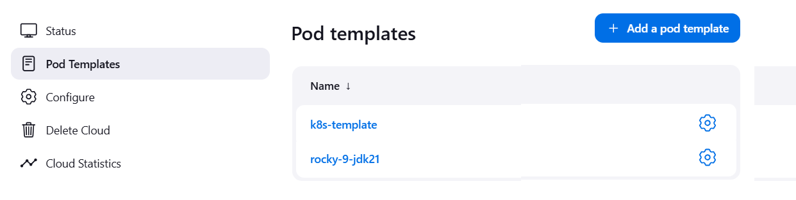
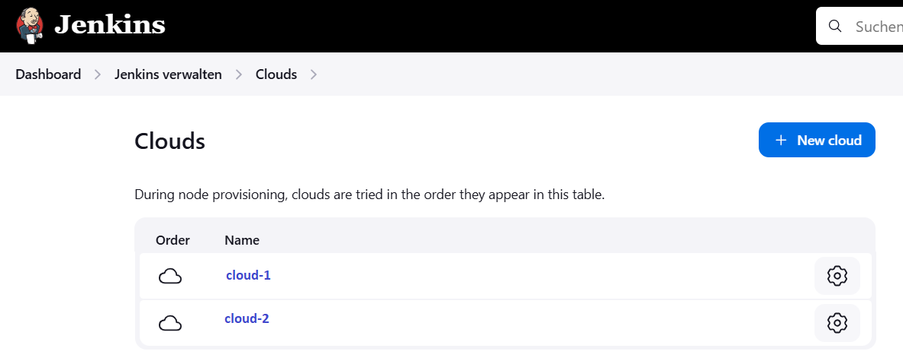
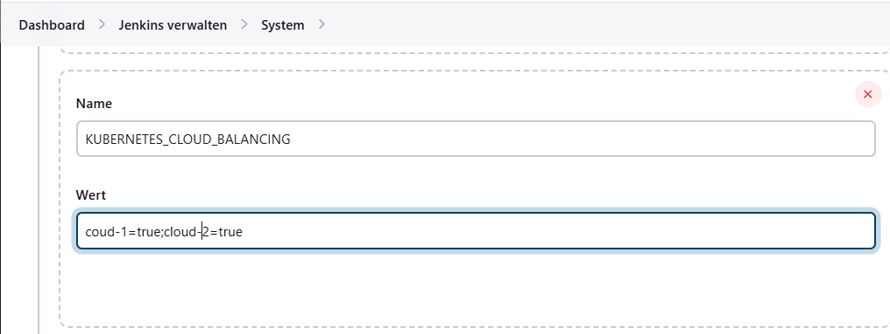
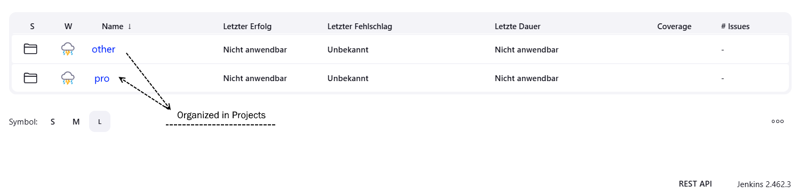
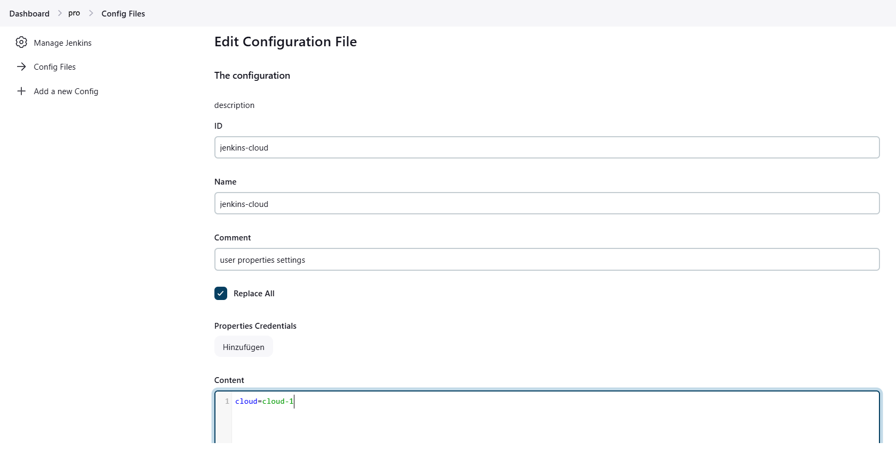
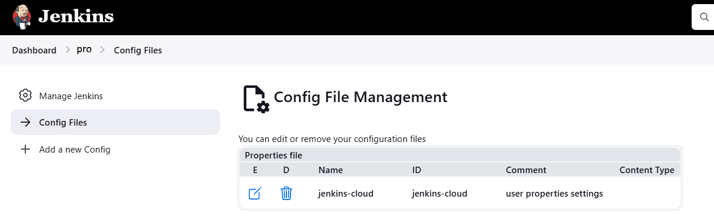

# Jenkins Kubernetes (K8s) Agent Setup with Load Balancing (jenkins-k8sagent-lib-lb)

This setup leverages a inspring shared Jenkins library ([jenkins-k8sagent-lib](https://github.com/liejuntao001/jenkins-k8sagent-lib)) for load balancing across multiple Kubernetes clusters. It provides a scalable and flexible solution for distributing Jenkins jobs across different clouds.

## Motivation and Design Goals

- **Load Balancing**: Distribute jobs across multiple clouds.
- **Cloud Preferences by Project**: Allow projects to prefer specific clouds (e.g., for caching or performance reasons).
- **Cloud Management**: Enable turning off a cloud for maintenance without reconfiguring builds. Jobs will automatically move to available clouds.
- **Zero Dependencies**: Jenkins Groovy is outdated and there is no yaml-parser besides SnakeYAML. Dont be dependend to a external library
## Usage in Jenkins Pipelines

Once the library is set up, you can use the `k8sagent` in your Jenkins pipeline like this:

```groovy
pipeline {
  agent {
    kubernetes(k8sagent())
  }  
}
```

# Prepare Setup

## Configure the Kubernetes Plugin for Jenkins

### Define a Cloud and Inherit Pod Templates

First, create a common root template that defines default settings. Then, extend this template for your build images (e.g., `rocky-9-jdk21`). Ensure the inheritance strategy is set to `merge`.


*Cloud Template Setup*

### Clone the Cloud to Target Other K8s Clusters and Update the API Server URL

Clone the cloud configuration to address additional Kubernetes clusters and modify the API server URL accordingly.



After this, you will have two working cloud configurations.

## Define a Variable in Jenkins System


*manage system*

You need a way to enable or disable clouds at runtime. The Kubernetes plugin does not provide a native "disable" function, so this feature must be managed manually or through custom configurations. I have created a Jira issue to address this limitation.

## Set Up Individual Projects

To enable load balancing at the project level, you need to install the `folder-plugin` and create a folder for each project. of course there can be several subfolder for the project (e.g. microservices)


*Folder example*

### Add Configuration in the Root Folder

Create a property file within each project folder. The key in this file will define the preferred cloud for that project.



#### Root-Folder overview



# Mapping Agents to Pods

Jenkinsfiles have a tendency to become outdated, so it is better to use a label like `base` (e.g., CentOS 7). When you use a mapping table that points `base` to `rocky-8` and later `rocky-9`, projects do not need to update the Jenkinsfile. The mapping is defined in a JSON file called `agents.json`. you can override that using `inheritFrom`

## Use Cases

### `k8sagent()` Method Configuration

The `k8sagent()` method is used to configure Kubernetes agents in Jenkins. Below is the description of the parameters available for configuring the Kubernetes plugin.

#### Parameters:

- **`project`** (optional): 
  - The folder name where configurations are looked up. If not specified, it will be determined automatically.
  
- **`agent`**: 
  - The key used for looking up an actual agent from the mapping table. 
  - **Benefit**: Using this lookup allows Jenkins maintainers to update the image name without needing to modify Jenkinsfiles. The default value is `base`.
  
- **`inheritFrom`**: 
  - Directly specifies the template to inherit from. If not provided, the agent logic will determine the template. This must fit the name in the cloud-config in the jenkins-gui

- **`containers`**: 
  - A list of container templates used by this library. Each container template must exist within the library.

- **`spec`**: 
  - A list of spec templates used by this library. Each spec template must also exist within the library.

- **`showRawYaml`**: 
  - If set to `true`, displays the raw pod YAML for the Kubernetes agent.

- **`debug`**: 
  - If set to `true`, displays the resulting configuration array for debugging purposes.

### Enhanced example
this pipeline starts the image tools:v1.0 along with the jndi-container on node worker06 with minimal resource request
```
pipeline {

	agent {
		kubernetes(k8sagent(containers:'tools:v1.0', spec:mini nodeSelector:worker06', debug:'true'))
	}


	stages {
		stage('container-demp') {
			steps {
				container('tools') {
					sh "yq"
				}
				 
				// executed in jndi-container
				sh 'echo hello from jndi-container' 
			}
		}
	}

}

```
